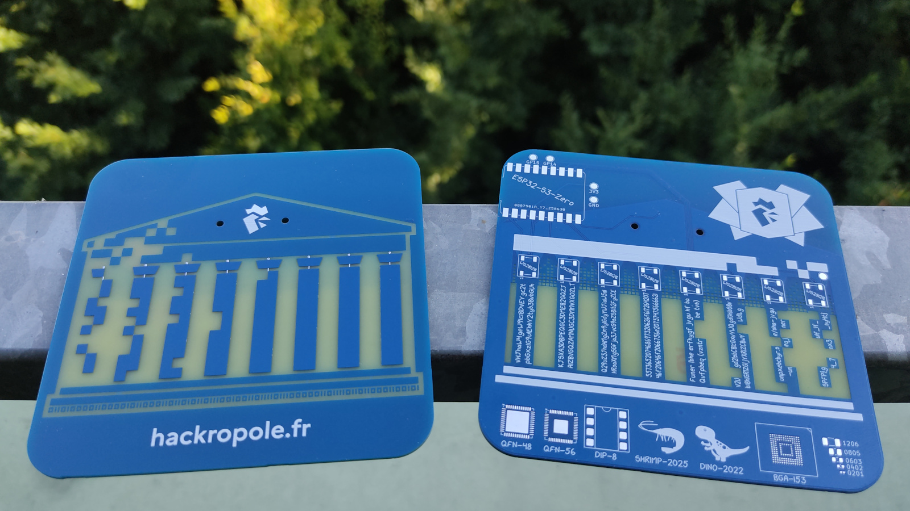

# Hackropole badge

<!--
SPDX-FileCopyrightText: 2025 Hackropole
SPDX-License-Identifier: CC-BY-4.0
-->

This repository contains the source files and build instructions for the Hackropole badge.

See [./hardware/](./hardware/) for PCB source files, and production instructions.

See [./assembly/](./assembly/README.en.md) for PCB assembly instructions (available in French and English).

See [./firmware-wled/](./firmware-wled/) for firmware flashing and configuration guide.

