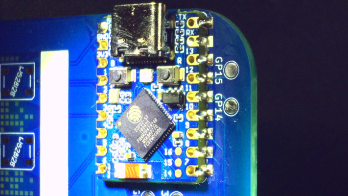

# Hackropole badge assembly

<!--
SPDX-FileCopyrightText: 2025 Hackropole
SPDX-License-Identifier: CC-BY-4.0
-->

You just got your brand-new Hackropole badge and are looking to assemble it?
You may follow this guide to get a working board.

> [!WARNING]
> The FCSC/Hackropole staff may not be held responsible if you hurt yourself during the assembly, break something, or hurt your cat.
> Please be careful with soldering irons, they are hot and can become quite dangerous if misused!

## Required components

Although the PCB allows for user modding and a lot of creativity, we highly recommend getting the following to have a baseline to build upon:

  - **1x [ESP32-S3-Zero](https://www.waveshare.com/wiki/ESP32-S3-Zero) without pin headers**, also sometimes called "ESP32-S3 Mini". It is available on [Waveshare shop](https://www.waveshare.com/product/arduino/boards-kits/esp32-s3/esp32-s3-zero.htm), but you may also find it on other suppliers such as [ThePiHut](https://thepihut.com/products/esp32-s3-zero-mini-development-board), or on some chinese marketplaces (those starting with "Ali"). Don't buy "SuperMini" variants, as their pinout is different and won't work!
  - **8x WS2812B LED, in 5050SMD packages**. They can be bought in large quantities (100pcs+) for a small fee at some international shops.
  - A soldering iron (better if temperature controlled) and some solder wire. Small USB-C soldering iron such as [those supported by IronOS](https://ralim.github.io/IronOS/) is great for beginners.

**Optional** components for modding your board later and to unleash your creativity:
  - Some neckband to hold the PCB as a conference badge (and look extra cool!).
  - A USB PowerBank to keep the badge powered even far away from a power outlet.
  - 2x M2 6mm nylon standoff (nut, bolt and hex pillar), to build a box lamp with 2 badges.
  - Some Qwiic-compatible sensors, and a Qwiic cable to solder on GP14/GP15/3V3/GND pads. Who said that your badge shouldn't have an ambient light sensor? :D

For more inspiration, you may take a look at [WLED usermods](https://github.com/wled/WLED/blob/main/usermods/readme.md).

## ESP32-S3-Zero and LED assembly

Starts by cleaning the board, especially the pads on which you are going to solder components.
Don't use water to clean as it might be corrosive, prefer isopropyl alcool.

> [!WARNING]
> Solder fumes contain a high number of particules.
> You should always solder with a fume extractor running, or at least in a highly-ventilated area.

Solder the ESP32-S3-Zero by putting some solder on pin 7, making sure the component is correctly placed, then putting solder on the opposite pin (5V) to lock the position. Then start soldering all pins one by one.
When you are happy about how the soldered pins turned out, clean the remaining flux on the PCB.

Use the same technique for each WS2812B LED, but lower a bit the solder iron temperature as the LED plastic can easily melt.
