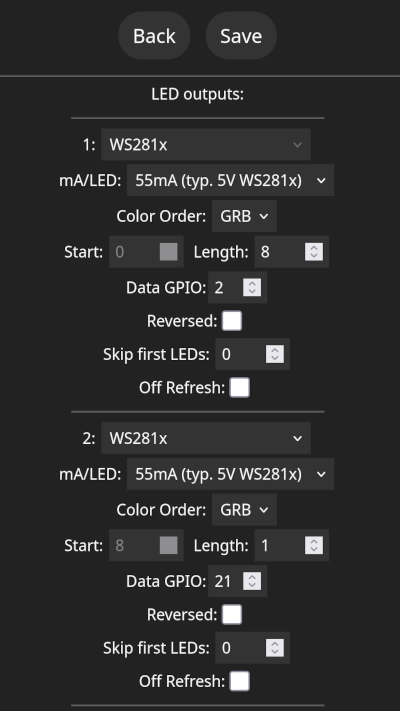

# Micrologiciel WLED

<!--
SPDX-FileCopyrightText: 2025 Hackropole
SPDX-License-Identifier: CC-BY-4.0
-->

[WLED](https://kno.wled.ge/) est un micrologiciel opensource permettant de
contrôler les LED WS2812 à l'aide d'une interface Web intuitive et avec des
boutons tactiles.
WLED est un logiciel libre distribué sous licence European Union Public License 1.2.

## Flasher le micrologiciel

Pour flasher le micrologiciel, vous avez besoin de l'utilitaire `esptool`.
Si votre distribution ne fournit pas `esptool`, vous pouvez suivre les
instructions officielles pour l'installer via pip :
<https://docs.espressif.com/projects/esptool/en/release-v4/esp32/installation.html>

Connectez le câble USB vers l'ESP32-S3 tout en appuyant sur le bouton de boot
(marqué « B ») pour passer en mode bootloader.
Assurez-vous que votre utilisateur peut écrire dans "/dev/ttyACM0". Ensuite :

```bash
esptool.py --port /dev/ttyACM0 erase_flash
esptool.py --port /dev/ttyACM0 write_flash 0x0 bootloader.bin
esptool.py --port /dev/ttyACM0 write_flash 0x8000 partitions.bin
esptool.py --port /dev/ttyACM0 write_flash 0x10000 firmware.bin
```

Réinitialisez ensuite la carte (par exemple en la débranchant).

## Compiler le micrologiciel à partir des sources

Si vous ne faites pas confiance à nos binaires pré-compilés, vous pouvez les
télécharger et les recompiler à partir du code source :

```bash
git clone https://github.com/wled/WLED
# checkout 28 Jun 2025 version, this matchs distributed pre-built binaries
git checkout cc81cc27b033b8358b4acc1f4155d51f31b83f5d
pio run -e esp32s3_4M_qspi -t upload
```

## Configuration initiale

Une fois le micrologiciel flashé, vous devriez voir apparaître un nouveau réseau
Wi-Fi nommé "WLED-AP".
Vous pouvez vous connecter à ce réseau à l'aide du mot de passe suivant :
"wled1234".
Vous devriez alors voir apparaître une page Web intitulée "Welcome to WLED!".
Vous pouvez appuyer sur "WIFI SETTINGS" pour configurer le badge en tant que
client Wi-Fi.

## Configuration des LED et des boutons

Le badge Hackropole dispose de :

- 8 LED WS2812B sur GPIO 2
- 1 LED WS2812B sur GPIO 21
- 8 boutons capacitifs sur les GPIO 1, 3, 4, 5, 7, 8, 9, 10 (chaque pilier) et
  un sur le GPIO 6 (crête du coq)
- GPIO 14 et 15 exposés sur des pads pour les usermods (par exemple pour des
  capteurs I2C 3,3 V, un microphone I2S)

Pour configurer la LED, rendez-vous dans `Config > LED Preferences`
(ou `http://DEVICE_IP/settings/leds`), puis dans "Hardware setup / LED outputs"
et configurez :

- Définissez `Length : 8`, `Data GPIO : 2`
- Appuyez sur '+' et définissez `Length : 1`, `Data GPIO : 21`



Pour configurer les boutons, allez sur la même page (toujours dans
`LED Preferences`) et configurez :

- Bouton 0 GPIO : 6 Touch
- Bouton 1 GPIO : 1 Touch
- Bouton 2 GPIO : 4 Touch
- Bouton 3 GPIO : 7 Touch

Par défaut, le bouton 0 devrait activer/désactiver la lumière et le bouton 1
devrait changer l'effet actif.

En raison d'une limitation du micrologiciel WLED, seuls 4 boutons tactiles
peuvent être configurés à la fois. Cependant, le matériel devrait pouvoir gérer
les 9 boutons.
