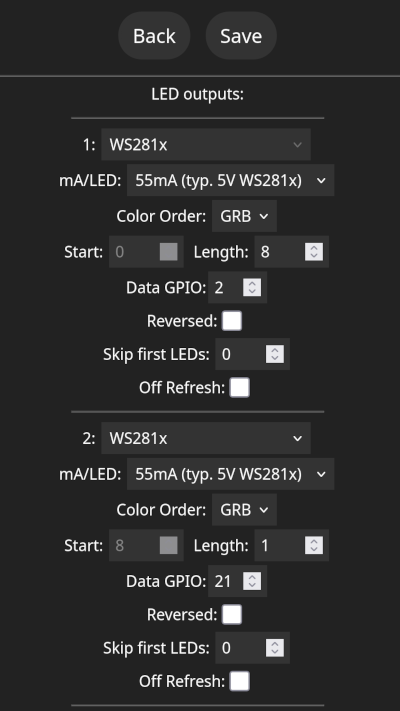

# WLED Firmware

<!--
SPDX-FileCopyrightText: 2025 Hackropole
SPDX-License-Identifier: CC-BY-4.0
-->

[WLED](https://kno.wled.ge/) is a opensource firmware to control WS2812 LEDs with a nice Web interface and touch buttons.
WLED is free software under the European Union Public License 1.2.

## Flash firmware

To flash the firmware, you need to have esptool installed.
If your package distribution does not ship esptool, you may follow the official
instructions to install it via pip:
<https://docs.espressif.com/projects/esptool/en/release-v4/esp32/installation.html>

Connect ESP32-S3 USB while pressing the boot button (marked "B") to enter the bootloader mode.
Make sure you user can write to '/dev/ttyACM0'. Then:
```bash
esptool.py --port /dev/ttyACM0 erase_flash
esptool.py --port /dev/ttyACM0 write_flash 0x0 bootloader.bin
esptool.py --port /dev/ttyACM0 write_flash 0x8000 partitions.bin
esptool.py --port /dev/ttyACM0 write_flash 0x10000 firmware.bin
```

Then reset the board (e.g. by unplugging it).

## Build firmware from sources

If you don't trust our pre-built binaries, you may download and rebuild them from source!

```bash
git clone https://github.com/wled/WLED
# checkout 28 Jun 2025 version, this matchs distributed pre-built binaries
git checkout cc81cc27b033b8358b4acc1f4155d51f31b83f5d
pio run -e esp32s3_4M_qspi -t upload
```

## Initial setup

After successfully flashing the firmware, you should see a new Wi-Fi network `WLED-AP`.
You may connect to this network using the following password: `wled1234`, then you should see a web page "Welcome to WLED!".
You may press "WIFI SETTINGS" to configure now the badge as a Wi-Fi client.

## LED and buttons configuration

The Hackropole badge has:
  - 8 WS2812B LED on GPIO 2
  - 1 WS2812B LED on GPIO 21
  - 8 capacitive touch buttons on GPIO 1, 3, 4, 5, 7, 8, 9, 10 (each pillar), and one on GPIO 6 (rooster's crest)
  - GPIO 14 and 15 exposed on pads for user modding (e.g. for 3.3V I2C sensors, I2S microphone)

To configure the LED, you should go to `Config > LED Preferences` (or `http://DEVICE_IP/settings/leds`), then in "Hardware setup / LED outputs" configure:
  - Set `Length: 8`, `Data GPIO: 2`
  - Press '+' and set `Length: 1`, `Data GPIO: 21`



To configure the buttons, go to the same page (still in `LED Preferences`), and configure:
  - Button 0 GPIO: 6 Touch
  - Button 1 GPIO: 1 Touch
  - Button 2 GPIO: 4 Touch
  - Button 3 GPIO: 7 Touch

By default button 0 should toggle the light, and button 1 should cycle effects.

Due to a limitation in WLED firmare, only 4 touch buttons can be configured at once. However the hardware should be able to handle all 9 buttons.
